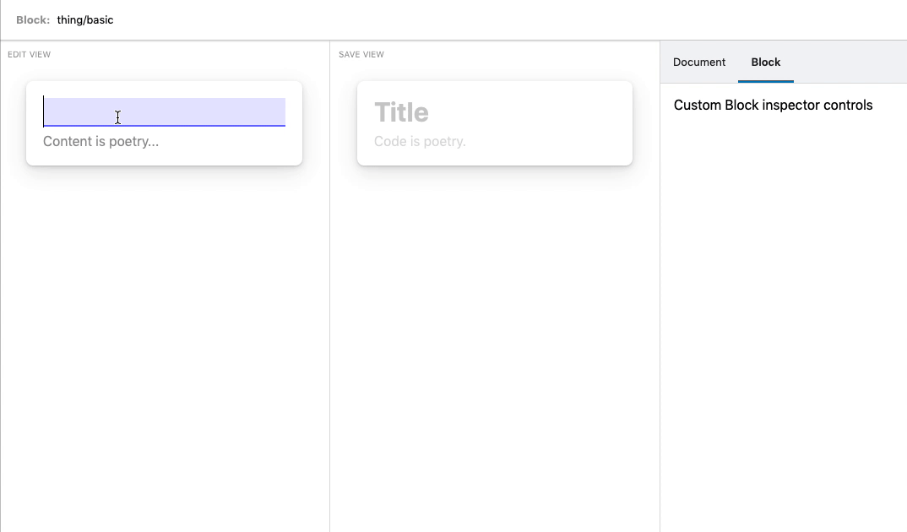

# 📘Gutenbook

> An experimental Storybook-based Gutenberg block dev environment.



## Get started

Once you clone this repo, install the project's dependencies by running:

```
npm install
```

Once that's done, fire up the dev environment by running:

```
npm start
```

The example Gutenberg blocks are located under `./blocks`.
